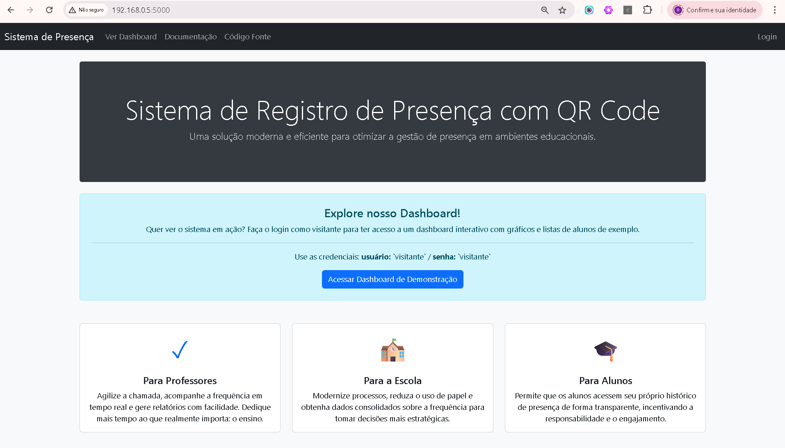

# Sistema de Registro de Presença com QR Code

Uma solução integrada que combina uma **aplicação de desktop** para registro de presença e uma **interface web** para visualização de dados e gerenciamento. Construído com Python, CustomTkinter e Flask.



---

## 📚 Documentação Completa

Para guias detalhados sobre funcionalidades, uso, desenvolvimento e solução de problemas, por favor, consulte a nossa **documentação na pasta `docs/`**. Lá você encontrará:
- [**Como Usar**](./docs/Como_usar.md): Guia passo a passo para usuários.
- [**Desenvolvimento**](./docs/Desenvolvimento.md): Detalhes técnicos sobre a arquitetura.
- [**Funcionalidades**](./docs/Funcionalidades.md): Descrição completa de cada recurso.
- [**Solução de Problemas**](./docs/TROUBLESHOOTING.md): Como resolver os erros mais comuns.

---

## ✨ Funcionalidades Principais

- **Aplicação Desktop**:
  - Registro de presença em tempo real via leitura de QR Code pela webcam.
  - Cadastro individual de alunos e usuários.
  - Importação de alunos em lote a partir de arquivos JSON.
  - Login automático na plataforma web para professores via QR Code.
- **Interface Web**:
  - Dashboard com estatísticas em tempo real (total de alunos, presentes, ausentes).
  - Gráfico de pizza para visualização rápida do status de presença.
  - Lista de alunos organizada por turmas em abas.
  - Perfis de acesso (`admin`, `professor`, `aluno`, `visitante`) com diferentes níveis de permissão.
  - Gerenciamento de usuários para administradores.

## 🚀 Início Rápido

Siga os passos abaixo para colocar a aplicação para funcionar.

### 1. Pré-requisitos
- Python 3.8+

### 2. Instalação

1.  **Clone o repositório:**
    ```bash
    git clone https://github.com/helioprofcaic/presenca-aluno.git
    cd presenca-aluno
    ```

2.  **Crie e ative um ambiente virtual:**
    ```bash
    # Windows
    python -m venv .venv
    .\.venv\Scripts\activate
    
    # Linux / macOS
    python3 -m venv .venv
    source .venv/bin/activate
    ```

3.  **Instale as dependências:**
    ```bash
    pip install -r requirements.txt
    ```

### 3. Executando a Aplicação

Com o ambiente virtual ativado, execute o comando:

```bash
python run.py
```

## 📖 Como Usar

A aplicação desktop é dividida em abas para facilitar o uso:

- **Aba "Apresentação"**: Tela inicial.
- **Aba "Ler QR Code"**: Aponte o QR Code do aluno para a câmera para registrar a presença.
- **Aba "Cadastrar Aluno"**: Preencha o formulário para adicionar um novo aluno.
- **Aba "Importar / Exportar"**: Importe alunos de arquivos `.json` e gerencie usuários.

Para um guia detalhado de como realizar cada uma dessas ações, consulte o **[Manual do Usuário](./docs/Como_usar.md)**.

## 📂 Estrutura do Projeto


```
presenca-aluno/
│
├── .venv/                   # Ambiente virtual do Python
├── data/                    # Arquivos .json para importação de alunos
│   ├── 294815.json
│   └── turmas-com-disciplinas.json
├── docs/                    # Documentação do projeto
│   ├── Como_usar.md
│   ├── Desenvolvimento.md
│   ├── Funcionalidades.md
│   └── TROUBLESHOOTING.md
├── qrcodes/                 # Onde os QR Codes gerados são salvos
│   └── turma_294815_ra_12345.png
│
├── web/                     # Aplicação web (Flask)
│   ├── static/              # Arquivos estáticos (CSS, JS, imagens)
│   └── templates/           # Templates HTML (Jinja2)
│   └── app.py               # Ponto de entrada da aplicação web
├── desktop/                 # Aplicação desktop (CustomTkinter)
│   └── main.py              # Ponto de entrada da aplicação desktop
├── database.py              # Módulo de interação com o banco de dados SQLite
├── presenca.db              # Banco de dados SQLite
├── run.py                   # Ponto de entrada principal (inicia desktop e web)
├── requirements.txt         # Lista de dependências Python
└── alunos.csv               # Arquivo CSV legado, não mais utilizado como banco de dados.
```